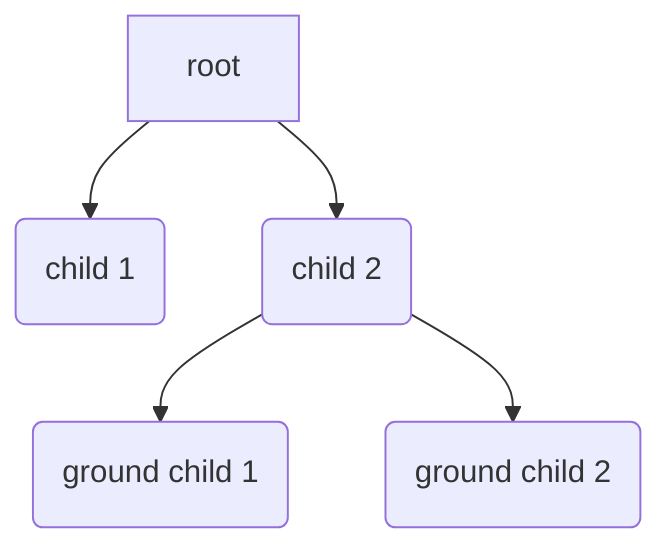

# AsyncTkinter

[Youtube](https://youtu.be/8XP1KgRd3jI)

`asynctkinter` is an async library that saves you from ugly callback-based code,
like most of async libraries do.
Let's say you want to do:

1. `print('A')`
1. wait for 1sec
1. `print('B')`
1. wait for a label to be pressed
1. `print('C')`

in that order.
Your code would look like this:

```python
def what_you_want_to_do(label):
    bind_id = None
    print('A')

    def one_sec_later(__):
        nonlocal bind_id
        print('B')
        bind_id = label.bind('<Button>', on_press, '+')
    label.after(1000, one_sec_later)

    def on_press(event):
        label.unbind('<Button>', bind_id)
        print('C')
```

It's barely readable and not easy to understand.
If you use `asynctkinter`, the code above will become:

```python
import asynctkinter as at

async def what_you_want_to_do(label):
    print('A')
    await at.sleep(1000, after=label.after)
    print('B')
    await at.event(label, '<Button>')
    print('C')
```

## Installation

If you use this module, it's recommended to pin the minor version, because if
it changed, it usually means some *important* breaking changes occurred.

```text
poetry add asynctkinter@~0.2
pip install "asynctkinter>=0.2,<0.3"
```

## Usage

```python
from functools import partial
from tkinter import Tk, Label
import asynctkinter as at
at.patch_unbind()

root = Tk()
label = Label(root, text='Hello', font=('', 60))
label.pack()

async def async_func(label):
    sleep = partial(at.sleep, after=label.after)

    # wait for 2sec
    await sleep(2000)

    # wait for a label to be pressed
    event = await at.event(label, '<Button>')
    print(f"pos: {event.x}, {event.y}")

    # wait until EITHER a label is pressed OR 5sec passes.
    # i.e. wait at most 5 seconds for a label to be pressed.
    tasks = await at.or_(
        at.event(label, '<Button>'),
        sleep(5000),
    )
    print("The label was pressed" if tasks[0].done else "5sec passed")

    # wait until BOTH a label is pressed AND 5sec passes.
    tasks = await at.and_(
        at.event(label, '<Button>'),
        sleep(5000),
    )


at.start(async_func(label))
root.mainloop()
```

### synchronization primitive

There is a [trio.Event](https://trio.readthedocs.io/en/stable/reference-core.html#trio.Event) equivalent.

```python
import asynctkinter as at

async def task_A(e):
    print('A1')
    await e.wait()
    print('A2')
async def task_B(e):
    print('B1')
    await e.wait()
    print('B2')

e = at.Event()
at.start(task_A(e))
# A1
at.start(task_B(e))
# B1
e.set()
# A2
# B2
```

Unlike Trio's and asyncio's, when you call ``Event.set()``,
the tasks waiting for it to happen will *immediately* be resumed.
As a result, ``e.set()`` will return *after* ``A2`` and ``B2`` are printed.

### threading

`asynctkinter` doesn't have any I/O primitives like Trio and asyncio do,
thus threads are the only way to perform them without blocking the main-thread:

```python
from concurrent.futures import ThreadPoolExecuter
import asynctkinter as at

executer = ThreadPoolExecuter()

async def some_task(widget):
    # create a new thread, run a function inside it, then
    # wait for the completion of that thread
    r = await at.run_in_thread(thread_blocking_operation, after=widget.after)
    print("return value:", r)

    # run a function inside a ThreadPoolExecuter, and wait for the completion.
    # (ProcessPoolExecuter is not supported)
    r = await at.run_in_executer(thread_blocking_operation, executer, after=widget.after)
    print("return value:", r)
```

Exceptions(not BaseExceptions) are propagated to the caller,
so you can catch them like you do in synchronous code:

```python
import requests
import asynctkinter as at

async def some_task(widget):
    try:
        r = await at.run_in_thread(lambda: requests.get('htt...', timeout=10), after=widget.after)
    except requests.Timeout:
        print("TIMEOUT!")
    else:
        print('RECEIVED:', r)
```

### dealing with cancellations

``asynctkinter.start()`` returns a ``Task``,
which can be used to cancel the execution.

```python
task = asynctkinter.start(async_func())
...
task.cancel()
```

When `.cancel()` is called, `GeneratorExit` will occur inside the awaitable,
which means you can prepare for cancellations as follows:

```python
async def async_func():
    try:
        ...
    except GeneratorExit:
        print('cancelled')
        raise  # You must re-raise !!
    finally:
        # do resource clean-up here
```

You are not allowed to `await` inside except-GeneratorExit-clause and finally-clause if you want the awaitable to be cancellable
because cancellations always must be done immediately.

```python
async def async_func():
    try:
        await something  # <-- ALLOWED
    except Exception:
        await something  # <-- ALLOWED
    except GeneratorExit:
        await something  # <-- NOT ALLOWED
        raise
    finally:
        await something  # <-- NOT ALLOWED
```

You are allowed to `await` inside finally-clause if the awaitable will never get cancelled.

```python
async def async_func():  # Assuming this never gets cancelled
    try:
        await something  # <-- ALLOWED
    except Exception:
        await something  # <-- ALLOWED
    finally:
        await something  # <-- ALLOWED
```

As long as you follow the rules above, you can cancel tasks as you wish.
But note that if there are lots of explicit calls to `Task.cancel()` in your code,
**it's a sign of your code being not well-structured**.
You can usually avoid it by using `asynctkinter.and_()` and `asynctkinter.or_()`.  

## Structured Concurrency

(This section is incomplete, and will be filled some day.)

`asynctkinter.and_()` and `asynctkinter.or_()` follow the concept of [structured concurrency][njs_sc].

```python
import asynctkinter as at

async def root():
    await at.or_(child1(), child2())

async def child1():
    ...

async def child2():
    await at.and_(ground_child1(), ground_child2())

async def ground_child1():
    ...

async def ground_child2():
    ...
```



## Misc

- Why is `patch_unbind()` necessary? Take a look at [this](https://stackoverflow.com/questions/6433369/deleting-and-changing-a-tkinter-event-binding).

[njs_sc]:https://vorpus.org/blog/notes-on-structured-concurrency-or-go-statement-considered-harmful/